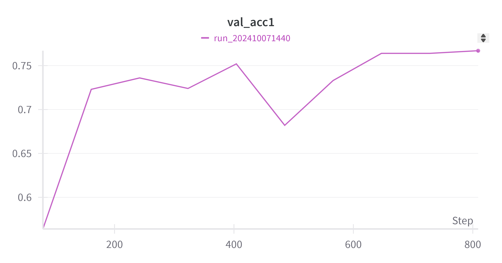
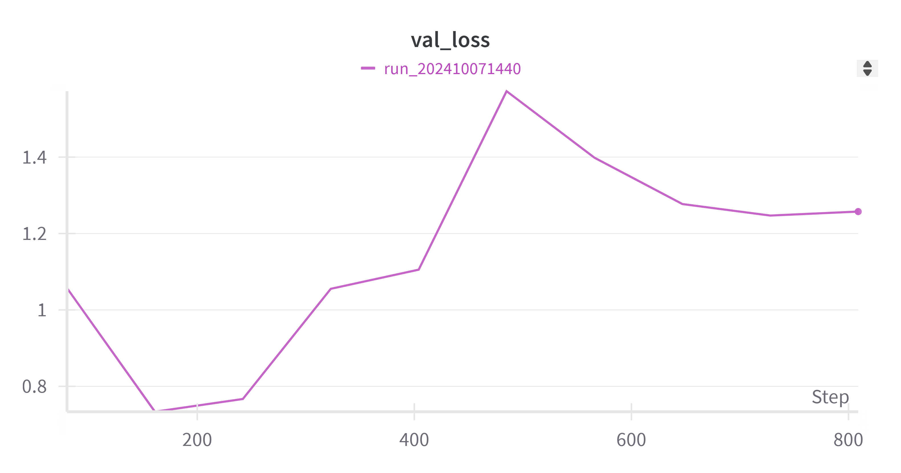
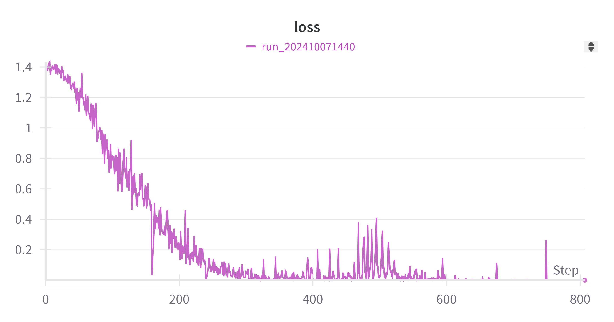
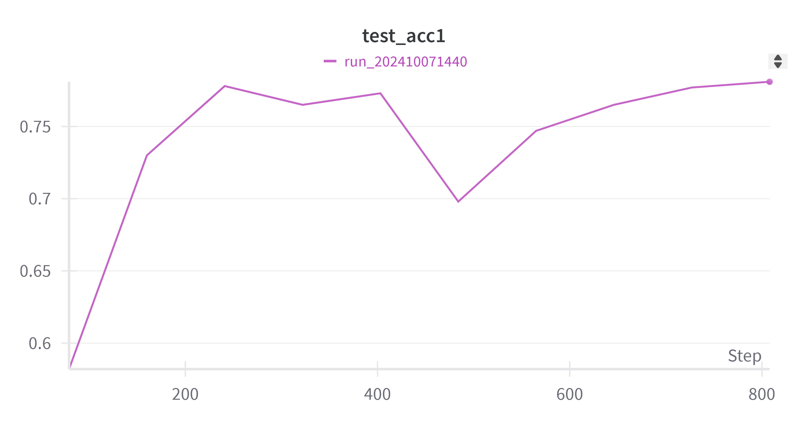
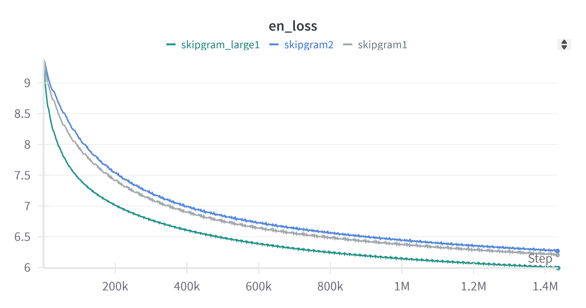
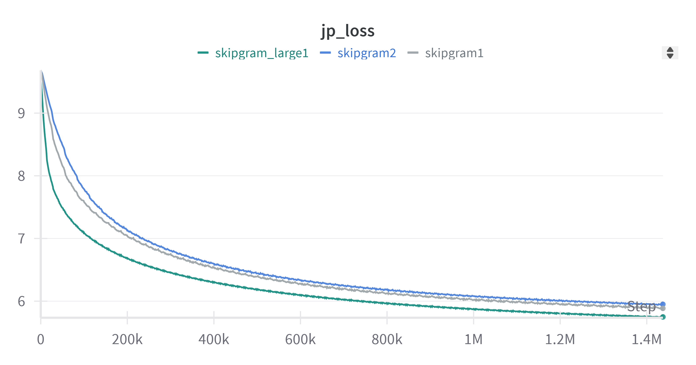
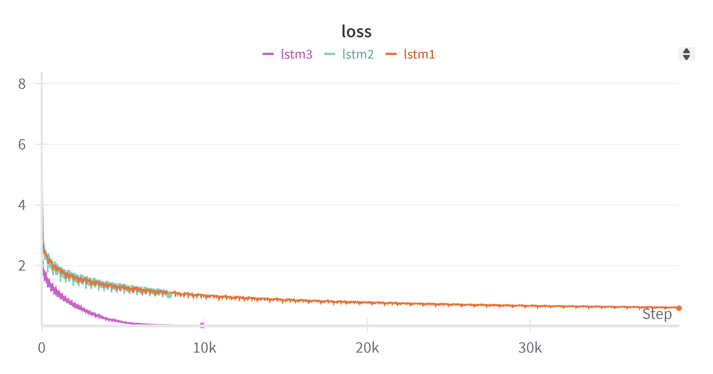
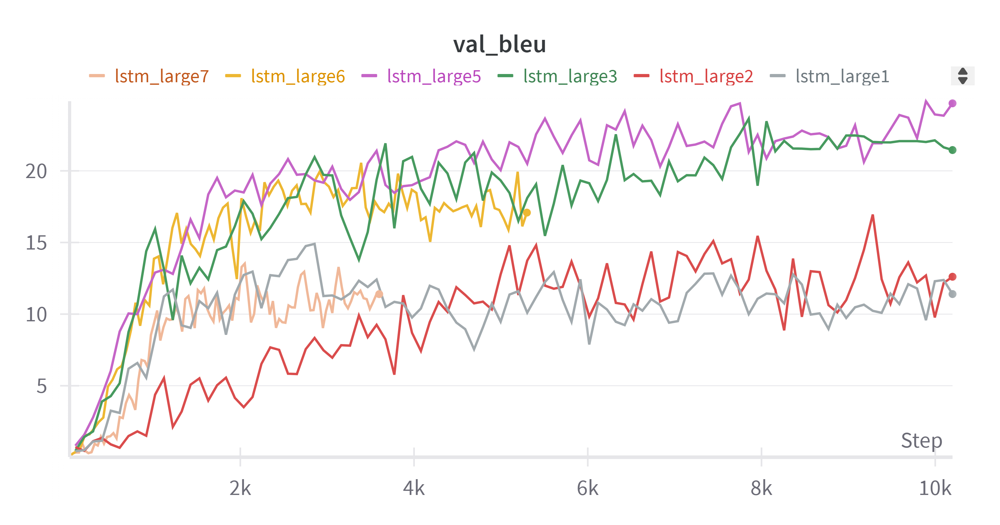

# 2024Autumn-NLP-Assignment1

## Task1

- `flatten_list(nested_list: list)`

Since we cannot determine how many nested levels the input list has, we need to use a recursive function to flatten the list. The function `flatten_list` takes a nested list as input and returns a flattened list.

And here we present some experiment results when processing a larger scale of nested list. **Each column of the table has the same nesting layer number, ranging from 1 to 10. Each row of the table has the same number of elements, ranging from 1e2 to 1e6.**

<table>
  <tr>
    <th style="background-color: #FFFFFF; "></th>
    <th style="background-color: #d6d6fe; ">1</th>
    <th style="background-color: #d6d6fe; ">2</th>
    <th style="background-color: #d6d6fe; ">3</th>
    <th style="background-color: #d6d6fe; ">4</th>
    <th style="background-color: #d6d6fe; ">5</th>
    <th style="background-color: #d6d6fe; ">6</th>
    <th style="background-color: #d6d6fe; ">7</th>
    <th style="background-color: #d6d6fe; ">8</th>
    <th style="background-color: #d6d6fe; ">9</th>
    <th style="background-color: #d6d6fe; ">10</th>
  </tr>
  <tr>
    <th style="background-color: #fe6062;">1e2</td>
    <td style="background-color: #FFFFFF;">0.000</td>
    <td style="background-color: #FFFFFF;">0.000</td>
    <td style="background-color: #FFFFFF;">0.000</td>
    <td style="background-color: #FFFFFF;">0.000</td>
    <th style="background-color: #061c6d; color: #FFFFFF">0.001</td>
    <td style="background-color: #FFFFFF;">0.000</td>
    <td style="background-color: #FFFFFF;">0.000</td>
    <td style="background-color: #FFFFFF;">0.001</td>
    <td style="background-color: #FFFFFF;">0.000</td>
    <td style="background-color: #FFFFFF;">0.000</td>
  </tr>
  <tr>
    <th style="background-color: #fe6062;">1e3</td>
    <td style="background-color: #FFFFFF;">0.000</td>
    <td style="background-color: #FFFFFF;">0.000</td>
    <th style="background-color: #061c6d; color: #FFFFFF">0.004</td>
    <td style="background-color: #FFFFFF;">0.000</td>
    <td style="background-color: #FFFFFF;">0.000</td>
    <td style="background-color: #FFFFFF;">0.003</td>
    <td style="background-color: #FFFFFF;">0.001</td>
    <td style="background-color: #FFFFFF;">0.002</td>
    <td style="background-color: #FFFFFF;">0.001</td>
    <td style="background-color: #FFFFFF;">0.001</td>
  </tr>
  <tr>
    <th style="background-color: #fe6062;">1e4</td>
    <td style="background-color: #FFFFFF;">0.000</td>
    <td style="background-color: #FFFFFF;">0.004</td>
    <td style="background-color: #FFFFFF;">0.004</td>
    <td style="background-color: #FFFFFF;">0.012</td>
    <td style="background-color: #FFFFFF;">0.007</td>
    <td style="background-color: #FFFFFF;">0.017</td>
    <td style="background-color: #FFFFFF;">0.014</td>
    <td style="background-color: #FFFFFF;">0.016</td>
    <td style="background-color: #FFFFFF;">0.016</td>
    <th style="background-color: #061c6d; color: #FFFFFF">0.030</td>
  </tr>
  <tr>
    <th style="background-color: #fe6062;">1e5</td>
    <td style="background-color: #FFFFFF;">0.007</td>
    <td style="background-color: #FFFFFF;">0.032</td>
    <td style="background-color: #FFFFFF;">0.045</td>
    <td style="background-color: #FFFFFF;">0.059</td>
    <td style="background-color: #FFFFFF;">0.078</td>
    <td style="background-color: #FFFFFF;">0.105</td>
    <td style="background-color: #FFFFFF;">0.129</td>
    <th style="background-color: #061c6d; color: #FFFFFF">0.157</td>
    <td style="background-color: #FFFFFF;">0.146</td>
    <td style="background-color: #FFFFFF;">0.157</td>
  </tr>
  <tr>
    <th style="background-color: #fe6062;">1e6</td>
    <th style="background-color: #900C3F; color: #FFFFFF;">0.093</td>
    <th style="background-color: #900C3F; color: #FFFFFF;">0.252</th>
    <th style="background-color: #900C3F; color: #FFFFFF;">0.405</th>
    <th style="background-color: #900C3F; color: #FFFFFF;">0.594</th>
    <th style="background-color: #900C3F; color: #FFFFFF;">0.732</th>
    <th style="background-color: #900C3F; color: #FFFFFF;">0.892</th>
    <th style="background-color: #900C3F; color: #FFFFFF;">1.038</th>
    <th style="background-color: #900C3F; color: #FFFFFF;">1.181</th>
    <th style="background-color: #900C3F; color: #FFFFFF;">1.377</th>
    <th style="background-color: #900C3F; color: #FFFFFF;">1.689</th>
  </tr>
</table>

Obviously, we can see that the time cost of the function **increases** with the number of elements and the nesting layer number. But the increase is **not apparent when the element number or the nesting layer number is small**.「Indicating that the increase is **not linear**.」

- `char_count(s: str)`

We try to use a dictionary to store the frequency of each character in the input string. The function `char_count` takes a string as input and returns a dictionary with the frequency of each character.

<table>
  <tr>
    <th style="background-color: #FFFFFF;">scale</td>
    <th style="background-color: #d6d6fe;">1e1</td>
    <th style="background-color: #d6d6fe;">1e2</td>
    <th style="background-color: #d6d6fe;">1e3</td>
    <th style="background-color: #d6d6fe;">1e4</td>
    <th style="background-color: #d6d6fe;">1e5</td>
    <th style="background-color: #d6d6fe;">1e6</td>
    <th style="background-color: #d6d6fe;">1e7</td>
    <th style="background-color: #d6d6fe;">1e8</td>
  </tr>
  <tr>
    <th style="background-color: #fe6062;">time cost</td>
    <td style="background-color: #FFFFFF;">0.000000</td>
    <td style="background-color: #FFFFFF;">0.000000</td>
    <td style="background-color: #FFFFFF;">0.000000</td>
    <td style="background-color: #FFFFFF;">0.000999</td>
    <td style="background-color: #FFFFFF;">0.029025</td>
    <td style="background-color: #FFFFFF;">0.127361</td>
    <td style="background-color: #FFFFFF;">1.161906</td>
    <th style="background-color: #900C3F; color: #FFFFFF">12.462080</th>
  </tr>
</table>

We can see that the time cost of the function **increases** with the length of the input string. And the increase is **not linear**. See the picture below for better understanding.


## Task2

We strictly implemented the method mentioned in the essay and with the following configurations:

```python
config = {
    "project": "nlp_homework1",
    "run_name": "run_202410071440",
    "batch_size": 64,
    "timeseq_len": 32,
    "lr": 0.001,
    "embedding_dim": 128,
    "class_num": 4,
    "filter_windows": [3, 4, 5],
    "filter_num": 100,
    "dropout_p": 0.5,
    "l2_constraint": 3.0,
    "linear_hidden_layers": [512, 64],
    "device": "auto", 
    "traindata_path": TRAIN_PATH,
    "testdata_path": TEST_PATH,
    "valdata_path": DEV_PATH,
    "patience": 8,
    "epochs": 100
}
```

Since we conducted the early stop algorithm on the validation set, so the epochs number did not actually reach 100. Actually, it stopped at epoch 9 due to the early stop, indicating that the model has already converged, and further training is unnecessary.

Here are the training validation accuracy and loss curves:





Here is the test set accuracy calculated at each checkpoint (test set is strictly not used during training):



The ultimate accuracy reaches ***0.781***, which is beyond the baseline 0.75.

## Task3

This part of the work is divided into two main steps: the first step is to train a word embedding model, where we use the skip-gram model training method; the second step is to train an lstm model, where there are many lstm and its variant structures to choose from, but here we want to verify that on the lstm model there is also the possibility that the expressive power increases with the model's increase with the model size. From the experimental results, the answer is yes.

### Word Embedding

The Skip-gram model is a widely used framework for training word embedding models, with the overall architecture being a word embedding layer and a classifier that tries to predict by the input word what its surrounding words in the text are.

Since it is difficult to have a very reasonable way to analyze the performance of word embedding models other than measuring their performance through downstream tasks, we chose the plainest way of observing the loss to select word embedding models, and finally selected the following hyper-parameterized word embedding models:

```python
# skipgram configuration
skipgram_window_size: 5

# skipgram model configuration
embedding_dim: 512

# skipgram training configuration
skipgram_batch_size: 512
skipgram_lr: 0.001
skipgram_epochs: 100
```

The loss curves for the specific training process are as follows:




in which :

- skipgram_large1: embedding_dim=512, window_size=5
- skipgram1: embedding_dim=128, window_size=3
- skipgram2: embedding_dim=128, window_size=5

We can see that the larger the embedding model is, the better performance it has.

## LSTM

Similarly, we conducted numerous experiments on the lstm architecture. The main objective is to explore the role of model size and the number of parameters on the performance improvement. In the very first experiments, we got quite poor performance with a small word embedding model using the most basic lstm architecture, so we decided to simply increase the model size to see if we could enhance the generalization ability by increasing the model size, and thus get a better performance on the test set, the small model results are as follows:



in which: 

- lstm1: embedding_dim=128, lstm_batchsize=64, lstm_hidden_size=128, lstm_epoch=50
- lstm2: embedding_dim=128, lstm_batchsize=64, lstm_hidden_size=256, lstm_epoch=10
- lstm3: embedding_dim=128, lstm_batchsize=256, lstm_hidden_size=1024, lstm_epoch=50

thus in this circumstances, we can see the power of larger models, guiding us to use larger word embedding models, and perform the lstm_large experiments.

We further change the word embedding model into the 512 embedding size ones, and the results are as follows:



in which:

- lstm_large1: embedding_dim=512, lstm_batchsize=512, lstm_hidden_size=512, lstm_epoch=100
- lstm_large2: embedding_dim=512, lstm_batchsize=512, lstm_hidden_size=1024, lstm_epoch=100
- lstm_large3: embedding_dim=512, lstm_batchsize=512, lstm_hidden_size=1024, lstm_epoch=100 [with learning rate decay]
- lstm_large5: embedding_dim=512, lstm_batchsize=512, lstm_hidden_size=2048, lstm_epoch=100 [with learning rate decay]
- lstm_large6: embedding_dim=512, lstm_batchsize=1024, lstm_hidden_size=1024, lstm_epoch=100 [with learning rate decay]
- lstm_large7: embedding_dim=512, lstm_batchsize=1600, lstm_hidden_size=512, lstm_epoch=100 [with learning rate decay]

From the results, we see that learning rate decay and larger models means promising performance, and below is the Bleu score and perplexity of the best models(hyper large models, large models, medium models):

<table>
  <tr>
    <th style="background-color: #D6D6FE;">Batchsize</td>
    <th style="background-color: #D6D6FE;">Hiddensize</td>
    <th style="background-color: #D6D6FE;">Embeddingsize</td>
    <th style="background-color: #D6D6FE;">Epoch</td>
    <th style="background-color: #D6D6FE;">Bleu</td>
    <th style="background-color: #D6D6FE;">Perplexity</td>
  </tr>
  <tr>
    <th style="background-color: #FFFFFF;">512</td>
    <th style="background-color: #FFFFFF;">2048</td>
    <th style="background-color: #FFFFFF;">512</td>
    <th style="background-color: #FFFFFF;">100</td>
    <th style="background-color: #FFFFFF;">23.381755372482804</td>
    <th style="background-color: #FFFFFF;">1.0006452380571378</td>
  </tr>
  <tr>
    <th style="background-color: #FFFFFF;">512</td>
    <th style="background-color: #FFFFFF;">1024</td>
    <th style="background-color: #FFFFFF;">512</td>
    <th style="background-color: #FFFFFF;">100</td>
    <th style="background-color: #FFFFFF;">17.19251225080134</td>
    <th style="background-color: #FFFFFF;">1.0006413911915433</td>
  </tr>
  <tr>
    <th style="background-color: #FFFFFF;">1600</td>
    <th style="background-color: #FFFFFF;">512</td>
    <th style="background-color: #FFFFFF;">512</td>
    <th style="background-color: #FFFFFF;">100</td>
    <th style="background-color: #FFFFFF;">8.237452636451593</td>
    <th style="background-color: #FFFFFF;">1.000157087689093</td>
  </tr>
</table>

And at the end we perform the translation on the examples given by the handout:

```python

Japanese: 私の名前は愛です
English: My favorite name morning . 


Japanese: 昨日はお肉を食べません
English: I do n't eat breakfast breakfast . 


Japanese: いただきますよう
English: Do you want to dance ? 


Japanese: 秋は好きです
English: Strawberries like apples . 


Japanese: おはようございます
English: Good medicine up ? 
```

The project is current on github, and the link is https://github.com/nameistzzhang/2024Autumn-NLP-Assignment1.git
